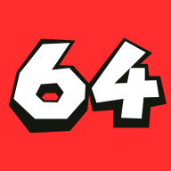
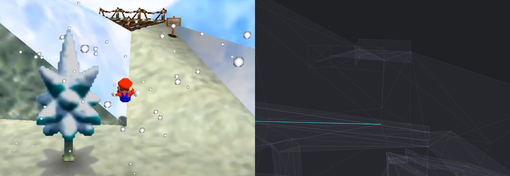
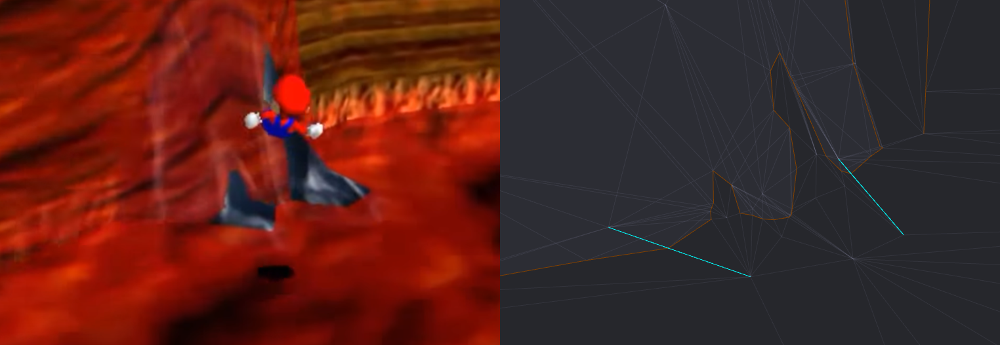
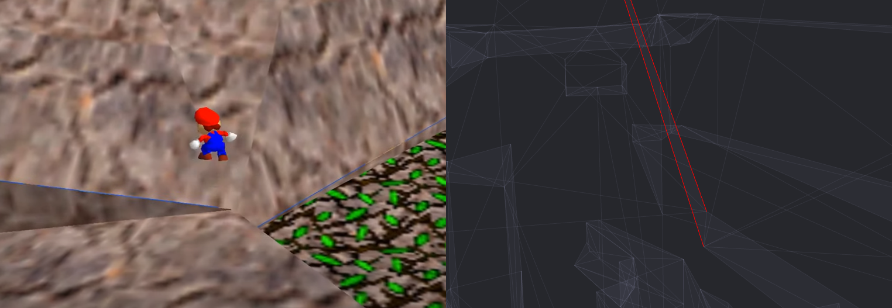
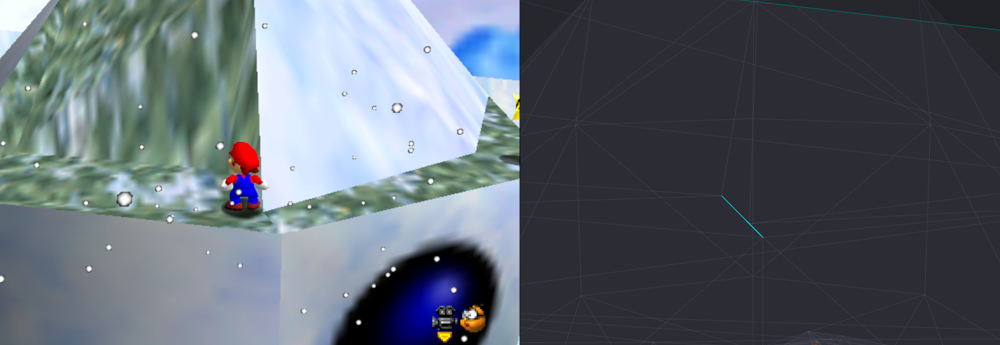

# topo64

A small project to help the Super Mario 64 TAS community to find topology errors in the collision models of the SM64 levels.

At the moment, **the tool focuses solely on topology errors** and ignores any physics or gameplay rules (no distinction between floor/wall/ceiling, no integer collision detection). The gaps reported may not always be useful from a gameplay perspective.

Gaps should be visible with the default camera settings if the camera is zoomed enough. Models can be downloaded as .obj if you need to make a more in-depth analysis of the gap. If are importing the .obj on a 3D editing software, remember to bump up the camera planes to somewhere around [0.1, 50000] because these models use integers.

## Process

The idea is to detect the tiny gaps caused by misaligned faces. These gaps can be observed around the edges of the polygons, or more precisely, around the "seam" edges of the geometry. We call seams the edges that are connected to less than 2 faces.

For each seam edge, we identity which section of the edge is aligned to another face (or edge of a face) in its neighborhood. Out of the remaining misaligned sections, we trying to figure out whether the misalignment is intentional by keeping track of the sections that are almost aligned.

## Results

The tool successfully spotted the gaps found by pannenkoek2012 in CCM and LLL.

The tool failed to spot a misalignment found at the very top of TTM but it turns out that this misalignment is not a seam gap but a ledge that was probably created by mistake.

On the above image, the 2 red edges belong to a triangle that was added to fill up the gap created by a tiny wall at the bottom of the slope. This triangle was meant to be a floor but because it connects with the tiny straight wall, it is also a wall itself. This results in a "fold" between 2 floors that was not supposed to be there.

An extra check for these "fold edges" was added, so these edges will show up in red in any level.

The tool also reported some suspicious gaps in VCUTM, SL, BOB, WDW, SL, or even inside the castle but most of these gaps don't fall on the integer space, so they might not be usable in game.

There's this gap at the top of SL that lets you through the Snowman's head when standing at (-18, 4352, 950).

## Color code

| Edge color  | Meaning |
| ----------- | ------- |
| Dark orange | Seam edge |
| Dark aqua | Misaligned seam, likely intentional (boundary) |
| Bright aqua | Misaligned seam, likely NOT intentional (gaps) |
| Red | Folded edges (those are NOT topology errors) |

## Controls

On desktop, use LMB to rotate, RMB to pan, MMB or mouse wheel to zoom.

On mobile, use 1 finger to rotate, 2 fingers to zoom or pan the view.

The following keybinds can also be used on desktop :

| Key | Action |
| --- | ------ |
| B   | Open/close File Browser |
| P   | Download collision model as .obj |
| 1   | Show/hide faces |
| 2   | Show/hide edges |
| 3   | Show/hide seams |
| 4   | Show/hide boundary seams (intentional gaps) |
| 5   | Show/hide misaligned seams (potentially unintentional gaps) |
| 6   | Show/hide folded edges |
| E   | Toggle X-ray vision |
| R   | Reset camera pose |

## Legal note

Collision models are property of Nintendo.

This project uses a JavaScript port of the Corner Table class from Google's Draco library (Apache 2.0 license)
https://github.com/google/draco/blob/master/src/draco/mesh/corner_table.h
